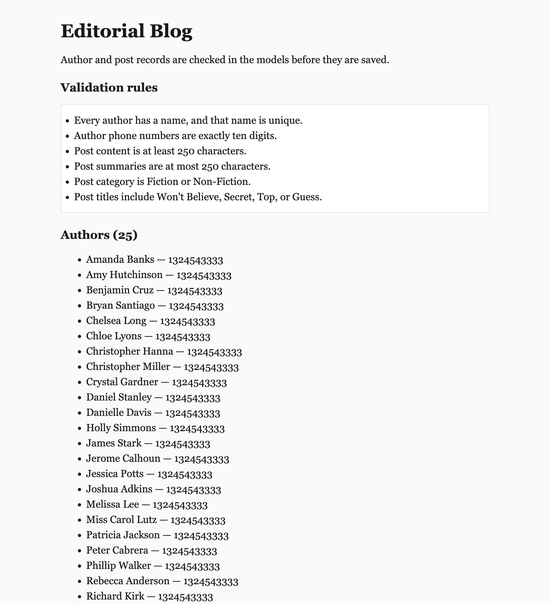

# Editorial Blog Validations

A small Flask and SQLAlchemy blog backend that rejects incomplete or misleading records before they are saved. Authors must have a unique name and a ten-digit phone number. Posts must have substantial content, a short summary, an allowed category, and a clickbait-style title.



## Validation rules

Rules are enforced on the `Author` and `Post` models with SQLAlchemy `@validates()` methods. Invalid values raise `ValueError` and are not stored.

| Model | Field | Rule |
| --- | --- | --- |
| Author | name | Required, and unique among authors |
| Author | phone number | Exactly ten digits |
| Post | content | At least 250 characters |
| Post | summary | At most 250 characters |
| Post | category | `Fiction` or `Non-Fiction` |
| Post | title | Must include `Won't Believe`, `Secret`, `Top`, or `Guess` |

## Setup

Install dependencies and create the local database:

```console
pipenv install
pipenv shell
cd server
flask db upgrade
python seed.py
```

The Pipfile targets Python 3.8.13. `flask db upgrade` creates `server/instance/app.db`. `python seed.py` loads 25 authors and 25 posts that already satisfy the rules.

## Usage

From the `server` directory, with the virtual environment active:

```console
python app.py
```

Open [http://127.0.0.1:5555](http://127.0.0.1:5555). The home page lists the validation rules and the authors and posts currently stored.

Creating a record in the Flask shell uses the same checks. This author is rejected because the phone number is too short:

```python
from app import app
from models import db, Author

with app.app_context():
    author = Author(name="Ada Lovelace", phone_number="555")
```

## Tests

From the project root:

```console
pytest -x
```

The suite in `server/testing/` covers each rule above. CodeGrade grades this project with those same tests.

## License

Educational content in this repository is covered by the [Learn.co Educational Content License](LICENSE.md).
